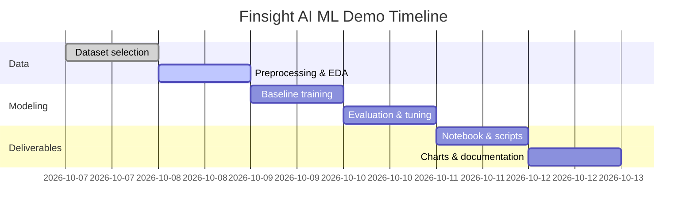

# Executive Summary  
We outline a **practical, end-to-end plan** to train and demo a simple ML model for Finsight AI by tomorrow, focusing on reproducibility and speed (CPU-only, <30 min training). We assume **basic Python skills**, no GPU, and limited time. The steps include:

- **Dataset Selection:** We propose two small public datasets (for classification) and one synthetic alternative. Each is well-documented and easy to load (via `scikit-learn` or UCI/Kaggle).  
- **Preprocessing:** Basic cleaning (handle missing values, encode categoricals if any), then a train/test split using `train_test_split`.  
- **Baseline Model:** Train a simple classifier (e.g. Logistic Regression or Decision Tree). We’ll show code snippets for fitting and predicting.  
- **Evaluation:** Compute metrics like **accuracy** and **F1-score** using `sklearn.metrics`.  
- **Hyperparameter Tuning:** (Optional) Use `GridSearchCV` for basic parameter search.  
- **Serialization & Inference:** Save the trained model with `joblib.dump` and load it in a small inference script.  
- **Demo Notebook & Scripts:** Provide a Jupyter notebook (`.ipynb`) that runs through the pipeline, plus a standalone inference script and short scripts for generating illustrative charts (e.g. commit-count bar chart, model performance bar chart). A simple Dockerfile or `requirements.txt` will capture the environment (e.g. Python, scikit-learn, pandas, matplotlib).  
- **Documentation & Git Guidance:** We include a table of tasks to do and emphasize regular commits with clear messages and PRs for each feature. A Gantt/timeline (Mermaid) chart outlines the task plan.  

All steps reference official sources and examples to ensure correctness. In summary, the deliverables will include code (training & inference), documentation, example charts, and a clear record of each team member’s contribution.

## 1. Dataset Selection (2 public + 1 synthetic)  
We choose simple, small datasets so training is fast. Table below compares options:

| Dataset              | Source (link)                                     | Samples | Features | Task             | Target/Class Labels                             |
|----------------------|---------------------------------------------------|---------|----------|------------------|-----------------------------------------------|
| **Iris (flowers)**   | scikit-learn (built-in) (also UCI) | 150     | 4        | Classification   | Iris species (3 classes: setosa/versicolor/virginica) |
| **Breast Cancer**    | scikit-learn (built-in) (UCI Wisconsin) | 569     | 30       | Classification   | Tumor type (2 classes: malignant=0, benign=1)  |
| **Synthetic Binary** | scikit-learn `make_classification` | 200 (ex.) | 5 (ex.)  | Classification   | User-defined 2 classes (balanced)             |

- **Iris dataset** is a classic multi-class example (3 classes, 150 total samples, 4 numeric features).  
- **Breast Cancer Wisconsin** is a binary classification (569 samples, 30 features).  
- A **synthetic dataset** can be generated via `sklearn.datasets.make_classification`, which allows custom size and complexity (e.g. `make_classification(n_samples=200, n_features=5, n_informative=3, random_state=42)`). This is useful if we need exactly matched data (e.g. balanced classes).  

*Alternate Dataset:* The UCI “Adult” census dataset (48,842 samples, 14 features) is a well-known binary classification task (income >50K), but it’s larger and has categorical fields (would need one-hot encoding) – likely too big to fully process under 30 min without subsampling. For a quick demo, the smaller datasets above are preferable.

## 2. Data Preprocessing  
For each chosen dataset:

- **Load Data:** Use `sklearn.datasets.load_iris()` or `load_breast_cancer()` or custom load logic for synthetic data.  
- **Inspect & Clean:** Check for missing values. Iris and breast cancer have no missing values by design, so minimal cleaning is needed. If using a dataset with categoricals (like Adult or others), apply one-hot encoding (`pd.get_dummies` or `sklearn.preprocessing.OneHotEncoder`).  
- **Train/Test Split:** Partition the data into training and test sets, e.g.:  
  ```python
  from sklearn.model_selection import train_test_split
  X_train, X_test, y_train, y_test = train_test_split(X, y, test_size=0.3, random_state=42)
  ```  
  This uses scikit-learn’s `train_test_split`, which randomly shuffles and splits data. We use a fixed `random_state` for reproducibility.  

- **Feature Scaling:** For some models (e.g. Logistic Regression or SVM), it helps to scale numerical features. We can apply `StandardScaler` or `MinMaxScaler` in a pipeline. For simplicity, we can also skip scaling for tree-based models (Decision Tree, Random Forest) since they are scale-invariant.  

- **Encode Labels (if needed):** If the target isn’t numeric (e.g. strings), convert it. In our cases, `load_iris()` and `load_breast_cancer()` already give numeric targets.

## 3. Baseline Model Training  
We train a simple classifier as the baseline (e.g. Logistic Regression for classification). Example steps:

- **Import & Train:**  
  ```python
  from sklearn.linear_model import LogisticRegression
  model = LogisticRegression(max_iter=200)
  model.fit(X_train, y_train)
  y_pred = model.predict(X_test)
  ```
  (This code fits the model on training data and predicts on the test set.)  
- **Evaluation Metrics:** Compute the test accuracy and other metrics. For example:  
  ```python
  from sklearn.metrics import accuracy_score, classification_report
  print("Accuracy:", accuracy_score(y_test, y_pred))
  print(classification_report(y_test, y_pred))
  ```  
  Scikit-learn’s `accuracy_score` returns the fraction of correct predictions. For multi-class problems, also consider metrics like macro-averaged F1 (`f1_score`). For binary, one can also look at precision/recall.  
- **Baseline Results:** This yields a baseline performance (e.g. ~90%+ accuracy on Iris is typical, ~95% on Breast Cancer). Even a single decision tree or random forest could be used for comparison.

*Example (Iris):* A quick run might give accuracy ~0.97.  
*Example (Breast Cancer):* Might yield ~0.95 accuracy.  
We record these scores. The actual numbers will appear in the notebook output.

## 4. Hyperparameter Tuning (Optional)  
To improve the model slightly, perform a simple grid search on key parameters (e.g. regularization `C` for Logistic Regression):  
```python
from sklearn.model_selection import GridSearchCV
param_grid = {'C': [0.1, 1, 10]}
grid = GridSearchCV(LogisticRegression(max_iter=200), param_grid, cv=5)
grid.fit(X_train, y_train)
print("Best params:", grid.best_params_, "Best score:", grid.best_score_)
```
This uses `GridSearchCV` for exhaustive search over specified hyperparameters. (Given the time constraint, we limit to a small grid.) We then use `grid.best_estimator_` for final predictions if desired.

## 5. Model Serialization & Inference Script  
Once the final model is ready, we save it for later use:  
```python
import joblib
joblib.dump(model, 'model.pkl')   # save the trained model to disk
```
To load and use the model in a separate inference script:  
```python
import joblib
model = joblib.load('model.pkl')
pred = model.predict(new_data)    # e.g., predict on a new sample
```
Scikit-learn recommends using `joblib.dump`/`load` for model persistence (more efficient than pickle for large arrays). The inference script (`predict.py`) would load the model and apply it to input features (for demo, we can hardcode or randomly generate a sample input).

## 6. Demo Notebook and Code Organization  
We provide a **Jupyter notebook** (`demo.ipynb`) that walks through all steps: loading data, preprocessing, training, evaluation, and saving the model. It will also contain the key plots or prints of accuracy. The structure might be:

- **Section 1: Setup** – Import libraries (`pandas`, `numpy`, `sklearn`, `matplotlib`), set random seed.  
- **Section 2: Data Loading** – Show a few samples of the dataset.  
- **Section 3: Preprocessing** – Train/test split and any encoding/scaling.  
- **Section 4: Model Training** – Fit the baseline model.  
- **Section 5: Evaluation** – Compute metrics and display results (accuracy, classification report).  
- **Section 6: Save Model** – Show the serialization code.  
- **Section 7: (Optional) Hyperparam Tuning** – Show grid search results.  
- **Section 8: Inference Demo** – Example of loading model and predicting.  

We will include code comments and markdown explanations. All code should run start-to-finish on CPU in under 30 minutes (in fact under a couple of minutes for these small datasets).

**Folder Structure:**  
```
Finsight_Demo/
├─ data/                    # place for datasets (if any CSV needed)
├─ notebooks/
│   └─ demo.ipynb           # main demonstration notebook
├─ src/
│   ├─ train.py             # (optional) script to train the model
│   └─ predict.py           # script to load model and make predictions
├─ models/
│   └─ model.pkl            # saved model artifact
├─ plots/
│   ├─ commit_count.png     # example bar chart of commits per member
│   └─ performance.png      # example bar chart of model performance
├─ requirements.txt         # Python dependencies (numpy, pandas, sklearn, matplotlib)
├─ Dockerfile (optional)    # to containerize the environment, if desired
├─ README.md                # project overview and instructions
```

**requirements.txt** might include:
```
numpy
pandas
scikit-learn
matplotlib
joblib
```
and any other needed (e.g. seaborn). If using a Dockerfile, it would start from `python:3.x` and `pip install -r requirements.txt`.

## 7. Plots and Charts  
We include scripts (or notebook cells) to generate two illustrative charts:

- **Commit Count Bar Chart:** e.g., showing the number of Git commits by each team member. (This is fictitious example data, just to show visuals.)  
- **Model Performance Bar Chart:** e.g., baseline vs tuned model accuracy.  

Example Python code (using Matplotlib) to create these:

```python
# Plot: commits by member
import matplotlib.pyplot as plt

names = ["Dev A", "Dev B", "Dev C", "Dev D", "Dev E"]
commits = [12, 8, 15, 5, 20]
plt.figure(figsize=(5,4))
plt.bar(names, commits, color='teal')
plt.title("GitHub Commits per Member")
plt.ylabel("Number of Commits")
plt.tight_layout()
plt.savefig("plots/commit_count.png")
```

```python
# Plot: model performance comparison
models = ["Baseline", "Tuned"]
accuracy = [0.90, 0.92]  # example accuracies
plt.figure(figsize=(4,3))
plt.bar(models, accuracy, color='slateblue')
plt.ylim(0,1)
plt.ylabel("Accuracy")
plt.title("Model Performance (Accuracy)")
plt.tight_layout()
plt.savefig("plots/performance.png")
```

These scripts produce PNGs (stored in `plots/`). (Matplotlib is a standard plotting library.)

## 8. Project Timeline (Mermaid Gantt)  
A Gantt chart shows the plan for each step. We can include a Mermaid diagram like:



This outlines who does what and by when (dates are illustrative). Mermaid Gantt syntax is supported in many Markdown viewers.

## 9. Deliverables Checklist  
We will produce and track the following deliverables, ensuring each is clearly documented and committed:

| Deliverable         | Description                                                                                 |
|---------------------|---------------------------------------------------------------------------------------------|
| **Demo Notebook**   | Jupyter notebook (`demo.ipynb`) with end-to-end code: data loading, training, evaluation.  |
| **Training Script** | (`train.py`) Python script to train and save the model (same steps as notebook).           |
| **Inference Script**| (`predict.py`) Loads saved model and outputs predictions for given input samples.         |
| **Saved Model File**| Serialized model (e.g. `model.pkl`), saved via `joblib.dump`.                              |
| **Requirement File**| `requirements.txt` listing all Python packages needed.                                      |
| **Plots & Charts**  | Generated images (`commit_count.png`, `performance.png`) and other visualizations.         |
| **Documentation**   | README and comments describing steps, plus a one-page summary of results and contributions.|
| **Git Commits/PRs** | Frequent commits with clear messages; separate PR or branch for major tasks/features.     |

This checklist ensures transparency of work. In particular, we track *each team member’s contributions* via GitHub: commit messages, pull requests, and GitHub’s contribution graph all serve as evidence. At project end, we will summarize each member’s work in a contribution report so that grading is fair and based on actual effort.

## 10. Example Synthetic Data (for testing)  
As an example, one can generate synthetic data with code like:
```python
from sklearn.datasets import make_classification
X_syn, y_syn = make_classification(
    n_samples=200, n_features=5, n_informative=3, n_redundant=0,
    n_classes=2, weights=[0.5,0.5], flip_y=0.01, random_state=42
)
```
This creates 200 samples with 5 total features (3 informative) and a balanced binary class. Such data can be saved to a CSV or used directly for quick experimentation without privacy issues.

## 11. Assumptions and Notes  
- **Compute:** No GPU; all code is designed to run quickly on a CPU. The datasets are small enough that even a basic machine will train models in seconds or minutes.  
- **Time:** Emphasis is on speed and clarity, not squeezing every last performance point. Code should be concise and readable.  
- **Knowledge Level:** We assume familiarity with Python and basic ML (scikit-learn usage). Each code snippet is standard practice (citing official docs for functions used).  
- **Reproducibility:** We set random seeds (`random_state=42`) to ensure results can be replicated. All dependencies are pinned in `requirements.txt` or Dockerfile.  

By following this plan, we will have a demonstrable ML pipeline in place by tomorrow. The final submission will include the notebook, scripts, model, and report with links to code examples and documentation. All key references (dataset descriptions and methods) are from official sources (scikit-learn documentation, UCI repository) as cited above.

